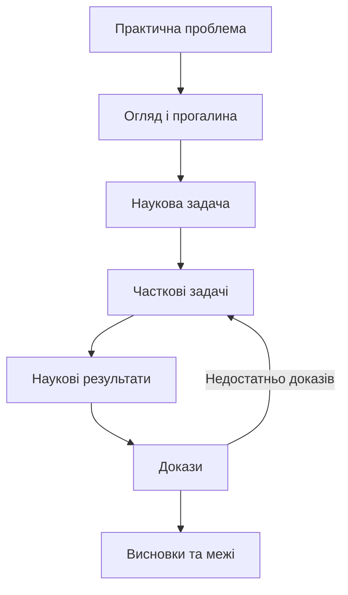

# Структурно-логічна схема

```mermaid
flowchart TD
 A[Практична проблема] --> B[Огляд і прогалина]
 B --> C[Наукова задача]
 C --> D[Часткові задачі]
 D --> E[Наукові результати]
 E --> F[Докази]
 F --> G[Висновки та межі]
 F -->|Недостатньо доказів| D
```

| ID задачі | Результат | Метод перевірки | Артефакт | Висновок |
|---|---|---|---|---|
| | | | | |
